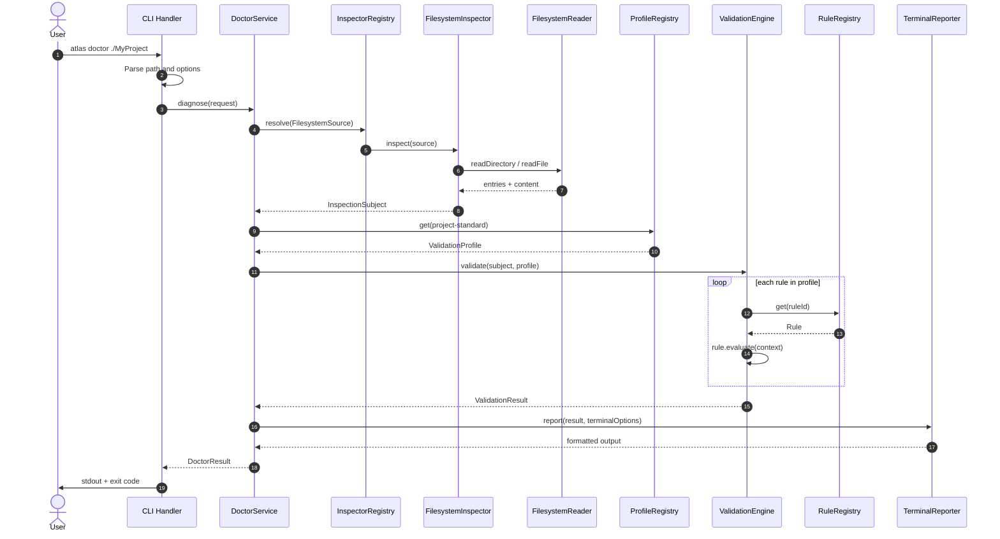
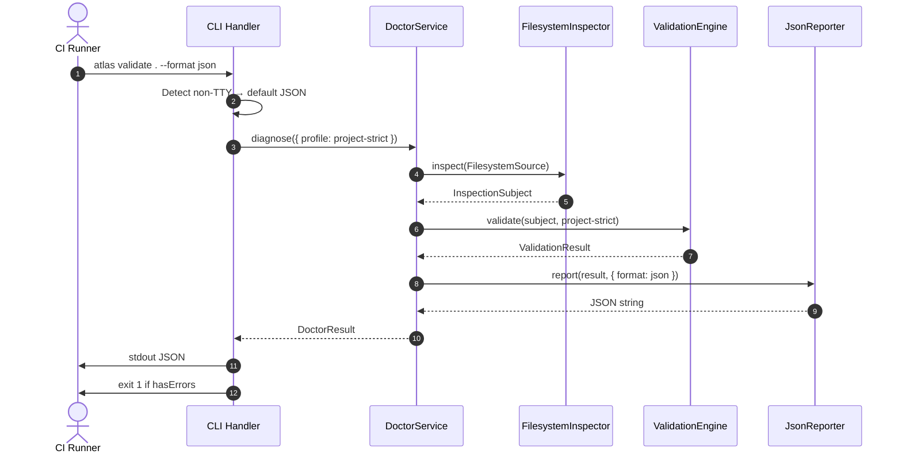
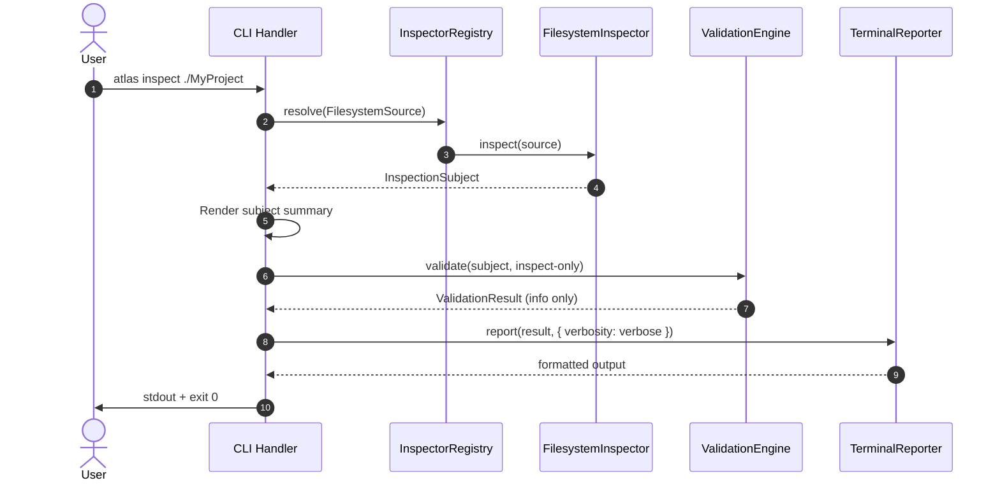

# SPEC-001: Project Intelligence Technical Specification

| Field           | Value                                              |
| --------------- | -------------------------------------------------- |
| **ID**          | SPEC-001                                           |
| **Title**       | Project Intelligence Technical Specification       |
| **Status**      | Draft                                              |
| **Date**        | 2026-07-12                                         |
| **Scope**       | Atlas CLI — Kernel (MS-07)                         |
| **Milestone**   | MS-07 — Project Intelligence                       |
| **Governed by** | [ADR-001](../09-adr/ADR-001-rendering-and-file-writing-separation.md), [ADR-002](../09-adr/ADR-002-project-intelligence-architecture.md) |

---

## Document Purpose

This specification defines the complete technical design for the **Project Intelligence** subsystem. It is the implementation blueprint for milestone **MS-07** and MUST be read together with ADR-001 and ADR-002.

This document is an **Engineering Specification**, not an Architecture Decision Record. It describes interfaces, data flow, module boundaries, and implementation sequencing. It does **not** contain production implementation code.

Normative language in this specification uses [RFC 2119](https://datatracker.ietf.org/doc/html/rfc2119) keywords: **MUST**, **MUST NOT**, **SHOULD**, **SHOULD NOT**, **MAY**.

---

## Table of Contents

1. [System Overview](#1-system-overview)
2. [Module Layout](#2-module-layout)
3. [InspectionSubject](#3-inspectionsubject)
4. [Inspector](#4-inspector)
5. [Validation Engine](#5-validation-engine)
6. [Validation Profiles](#6-validation-profiles)
7. [Rules](#7-rules)
8. [Diagnostics](#8-diagnostics)
9. [Reporter](#9-reporter)
10. [Doctor Service](#10-doctor-service)
11. [CLI Commands](#11-cli-commands)
12. [Dependency Injection](#12-dependency-injection)
13. [Sequence Diagrams](#13-sequence-diagrams)
14. [Extension Points](#14-extension-points)
15. [Non-functional Requirements](#15-non-functional-requirements)
16. [Implementation Roadmap](#16-implementation-roadmap)

---

## 1. System Overview

### 1.1 Position in the Atlas Kernel

Project Intelligence is a **horizontal kernel layer** that understands Atlas projects independently of how those projects were created or persisted. It sits between the CLI (and future API/IDE adapters) and the raw sources of project truth: the filesystem, in-memory generation artifacts, and future remote project snapshots.

```
┌─────────────────────────────────────────────────────────────────────────┐
│                              Consumers                                  │
│   CLI · CI · IDE Extension · HTTP API · Plugin Host                     │
└───────────────────────────────────┬─────────────────────────────────────┘
                                    │
                                    ▼
┌─────────────────────────────────────────────────────────────────────────┐
│                        Project Intelligence                             │
│   Inspector · Validation Engine · Profiles · Rule Registry            │
│   Diagnostics · Reporter · Doctor Service                               │
└───────┬─────────────────────────────┬───────────────────────────────────┘
        │ reads                       │ MAY consume
        ▼                             ▼
┌───────────────────┐       ┌─────────────────────┐
│ Filesystem        │       │ GenerationResult    │
│ (via adapter)     │       │ (in-memory)         │
└───────────────────┘       └─────────────────────┘

┌─────────────────────────────────────────────────────────────────────────┐
│                     Parallel Kernel Layers                              │
│                                                                         │
│  Template Engine ──► Project Generation Pipeline ──► GenerationResult   │
│                                                                         │
│  FileService ◄── InitProjectService (orchestration only)              │
└─────────────────────────────────────────────────────────────────────────┘
```

Project Intelligence **MUST NOT** be a subordinate of Generation or FileService. It **MUST NOT** invoke `TemplateEngine.render()` or `FileService.write()` for its core operations.

### 1.2 Relationship to Template Engine

| Aspect | Relationship |
| ------ | ------------ |
| **Dependency direction** | Project Intelligence **MUST NOT** depend on Template Engine for inspection or validation. |
| **Shared concepts** | Rules MAY reference template identifiers and expected rendered artifacts conceptually (e.g. README template output conventions). |
| **Template-author profile** | The `template-author` validation profile MAY validate template catalog metadata and registration integrity using Template Engine types as **read-only reference data**, not as a render pipeline. |
| **Boundary** | Template Engine answers *how to render*. Project Intelligence answers *whether the project state is valid*. |

The Template Engine remains a pure string transformation subsystem per ADR-001. No validation rule **MUST** call `engine.render()` during standard project health checks unless explicitly scoped to a template-author diagnostic profile and documented as a performance exception.

### 1.3 Relationship to Project Generation Pipeline

| Aspect | Relationship |
| ------ | ------------ |
| **Current state (Sprint-009)** | `ProjectGenerationPipeline` invokes `ProjectValidator` post-generation and attaches `ValidationResult` to `GenerationResult`. |
| **Target state (MS-07)** | Pipeline **SHOULD** delegate to Project Intelligence `Validator` with profile `generation-default`, using `GenerationInspector` to produce an `InspectionSubject`. |
| **Input** | `GenerationResult` is a valid inspection source; it **MUST** map to `InspectionSubject` without filesystem reads. |
| **Output** | `ValidationResult` remains attached to `GenerationResult.validation` for backward compatibility. |
| **Constraint** | Pipeline **MUST NOT** embed rule implementations or grow to perform on-disk inspection. |

Generation and intelligence compose at the orchestration boundary:

```
ProjectGenerationPipeline.generate()
  → build GenerationResult (files, directories, plan)
  → GenerationInspector.inspect(generationResult)
  → Validator.validate(subject, generation-default)
  → attach ValidationResult
  → return GenerationResult
```

### 1.4 Relationship to FileService

| Aspect | Relationship |
| ------ | ------------ |
| **Persistence** | FileService **MUST** remain the sole write boundary per ADR-001. |
| **Validation timing** | Generation-time validation runs **before** `FileService.write()` when composed by `InitProjectService`. |
| **On-disk validation** | `FilesystemInspector` reads project state **after** persistence; FileService is not involved. |
| **Write errors vs diagnostics** | FileService operational errors (permission denied, path exists) are **distinct** from governance diagnostics. They **MUST NOT** be modeled as `Diagnostic` unless a future rule explicitly maps write policy violations to governance codes. |

`InitProjectService` orchestration order **MUST** remain:

1. `pipeline.generate()` (includes generation-time validation)
2. `fileService.write()` (persistence only)
3. Return execution summary to CLI

If generation-time validation reports errors, `InitProjectService` **SHOULD** still return the `GenerationResult` to internal callers but **SHOULD NOT** invoke FileService when `validation.hasErrors` is true (behavior to be finalized in MS-07 integration task; default: block write on error).

### 1.5 Relationship to Diagnostics Framework (Sprint-009)

The existing `src/diagnostics/` package is the **seed implementation** of concepts formalized in ADR-002:

| Sprint-009 artifact | MS-07 evolution |
| ------------------- | --------------- |
| `Diagnostic` | Extended model in `src/intelligence/diagnostics/`; backward-compatible fields preserved |
| `DiagnosticSeverity` | Retained; aligned with Reporter filtering |
| `ValidationRule` | Evolves to `Rule` interface operating on `InspectionSubject` |
| `ProjectValidator` | Superseded by `ValidationEngine` with profile support |
| `ReadmeExistsRule`, `GovernanceReadmeExistsRule` | Migrated to `src/intelligence/rules/`; adapted to dual subject sources |
| `createDefaultProjectValidator()` | Replaced by profile-based factory |

Migration **MUST** be incremental. `src/diagnostics/` **SHOULD** re-export from `src/intelligence/` during a deprecation window to avoid breaking imports in tests and pipeline code.

### 1.6 Core Data Flow

All intelligence operations follow the same canonical pipeline:

```
InspectionSource
      │
      ▼
  Inspector.inspect()
      │
      ▼
 InspectionSubject  (immutable)
      │
      ▼
 Validator.validate(subject, profile)
      │
      ▼
 ValidationResult
      │
      ▼
 Reporter.report(result, options)   [optional per command]
      │
      ▼
 DoctorResult / CLI output / file export
```

**Inspector** collects. **Validator** judges. **Reporter** presents. No component **MAY** collapse these responsibilities.

---

## 2. Module Layout

### 2.1 Root Package

All Project Intelligence implementation **MUST** reside under:

```
src/intelligence/
```

### 2.2 Complete Directory Structure

```
src/intelligence/
├── index.ts                          # Public barrel; stable export surface
│
├── types/                            # Shared value types and enums
│   ├── index.ts
│   ├── inspection-source.ts          # Discriminated union of input sources
│   ├── inspection-subject.ts         # Normalized inspection model
│   ├── inspection-metadata.ts        # Provenance, timestamps, capabilities
│   ├── validation-result.ts          # Aggregated validation output
│   ├── doctor-result.ts              # Doctor workflow composite result
│   ├── report-options.ts             # Format, verbosity, filter options
│   └── severity.ts                   # Diagnostic severity enum
│
├── diagnostics/                    # Diagnostic model (canonical)
│   ├── index.ts
│   ├── diagnostic.ts                 # Extended Diagnostic type
│   ├── diagnostic-location.ts        # Line, column, range
│   ├── diagnostic-suggestion.ts      # Human remediation hint
│   └── quick-fix.ts                  # Future machine-applicable fix descriptor
│
├── inspector/                        # Inspection subsystem
│   ├── index.ts
│   ├── inspector.ts                  # Inspector interface
│   ├── inspector-error.ts            # Inspection failure types
│   ├── filesystem-inspector.ts       # On-disk project inspection
│   ├── generation-inspector.ts       # GenerationResult → subject
│   ├── remote-inspector.ts           # Future: remote snapshot inspection
│   ├── plugin-inspector.ts           # Future: plugin-provided subject adapter
│   └── adapters/
│       ├── filesystem-reader.ts      # Injectable read-only FS port
│       └── filesystem-reader-error.ts
│
├── validator/                        # Validation engine
│   ├── index.ts
│   ├── validation-engine.ts          # Validator implementation
│   ├── validation-engine-options.ts  # Parallelism, fail-fast, ordering
│   ├── rule-execution-context.ts     # Per-run immutable context for rules
│   └── rule-execution-result.ts      # Per-rule outcome metadata
│
├── profiles/                         # Validation profiles
│   ├── index.ts
│   ├── validation-profile.ts         # Profile type and builder
│   ├── profile-registry.ts           # Named profile registration
│   ├── generation-default.profile.ts
│   ├── project-standard.profile.ts
│   ├── project-strict.profile.ts
│   ├── inspect-only.profile.ts
│   └── template-author.profile.ts
│
├── rules/                            # Rule implementations
│   ├── index.ts
│   ├── rule.ts                       # Rule interface
│   ├── rule-metadata.ts              # ID, category, description, docs URL
│   ├── rule-registry.ts              # Rule registration and lookup
│   ├── readme-exists.rule.ts         # Migrated from diagnostics
│   ├── governance-readme-exists.rule.ts
│   └── ...                           # Additional rules per sprint
│
├── reporter/                         # Output formatting
│   ├── index.ts
│   ├── reporter.ts                   # Reporter interface
│   ├── terminal-reporter.ts
│   ├── json-reporter.ts
│   ├── markdown-reporter.ts
│   ├── sarif-reporter.ts
│   └── html-reporter.ts              # Future stub; not MS-07 MVP
│
├── doctor/                           # Health-check orchestration
│   ├── index.ts
│   └── doctor-service.ts
│
├── factories/                        # Composition root helpers
│   ├── index.ts
│   ├── create-intelligence-services.ts
│   ├── create-default-profile-registry.ts
│   └── create-default-rule-registry.ts
│
└── compat/                           # Temporary migration shims
    ├── index.ts
    └── diagnostics-shim.ts           # Re-exports for src/diagnostics/ consumers
```

### 2.3 Module Boundary Rules

| Module | MAY import from | MUST NOT import from |
| ------ | --------------- | -------------------- |
| `types/` | Nothing in intelligence except other `types/` | inspector, validator, CLI |
| `diagnostics/` | `types/` | inspector, reporter, CLI |
| `inspector/` | `types/`, `diagnostics/`, adapters | validator, reporter, rules |
| `validator/` | `types/`, `diagnostics/`, `rules/`, `profiles/` | inspector implementations, CLI |
| `profiles/` | `rules/`, `types/` | inspector, reporter |
| `rules/` | `types/`, `diagnostics/` | inspector, reporter, CLI |
| `reporter/` | `types/`, `diagnostics/` | inspector, validator, rules |
| `doctor/` | inspector, validator, reporter, types | CLI |
| `factories/` | All intelligence modules | CLI |
| `compat/` | intelligence public API | CLI |

### 2.4 Public Export Surface

`src/intelligence/index.ts` **MUST** export only stable consumer types:

- `InspectionSubject`, `InspectionSource`, `InspectionMetadata`
- `ValidationResult`, `DoctorResult`
- `Diagnostic`, `DiagnosticSeverity`, `DiagnosticLocation`
- `Inspector` (interface), `ValidationEngine`, `Reporter` (interface), `DoctorService`
- `ValidationProfile`, `ProfileRegistry`, `RuleRegistry`
- Factory functions: `createIntelligenceServices()`, `createDefaultProfileRegistry()`, `createDefaultRuleRegistry()`

Internal rule implementations **MAY** remain private to the package unless registered through `RuleRegistry`.

---

## 3. InspectionSubject

### 3.1 Purpose

`InspectionSubject` is the **immutable, normalized representation** of everything validation rules are allowed to observe about a project at a point in time. It decouples rules from filesystem layout, CLI paths, and `GenerationResult` internal structure.

Rules **MUST** depend only on `InspectionSubject` (and `RuleExecutionContext`), never on raw `fs` handles or `GenerationResult`.

### 3.2 Immutability Requirements

- `InspectionSubject` **MUST** be deeply immutable from the consumer's perspective.
- All collection fields **MUST** be `readonly` arrays or frozen maps.
- Inspectors **MUST** produce a new subject per inspection; in-place mutation **MUST NOT** occur.
- `InspectionSubject` **MUST** be safe to pass across async validation without defensive copying if the producer guarantees immutability.

### 3.3 Required Fields

| Field | Type | Description |
| ----- | ---- | ----------- |
| `id` | `string` | Unique subject instance identifier (UUID or deterministic hash of source + timestamp). |
| `sourceKind` | `InspectionSourceKind` | One of: `filesystem`, `generation`, `remote`, `plugin`. |
| `projectName` | `string` | Resolved project name (from directory name, `GenerationResult.projectName`, or remote metadata). |
| `rootLabel` | `string` | Human-readable root description (absolute path, `"<generation>"`, remote URI). **MUST NOT** be used as a write target by rules. |
| `files` | `readonly InspectedFile[]` | Normalized file index. |
| `directories` | `readonly string[]` | Normalized relative directory paths (POSIX-style `/`). |
| `metadata` | `InspectionMetadata` | Provenance and capabilities (see §3.5). |

### 3.4 InspectedFile Model

Each `InspectedFile` **MUST** include:

| Field | Required | Description |
| ----- | -------- | ----------- |
| `relativePath` | Yes | POSIX-style path from project root. |
| `exists` | Yes | Whether the file is present in the subject source. |
| `content` | No | UTF-8 text content when available and permitted by source policy. |
| `contentEncoding` | No | Encoding label (default `utf-8`). |
| `sizeBytes` | No | Size when content is not loaded (large file policy). |
| `lastModified` | No | ISO-8601 timestamp when available. |
| `contentLoaded` | Yes | Boolean: whether `content` was eagerly loaded. |

**Content loading policy:** `FilesystemInspector` **SHOULD** load content for text files under a configurable size threshold (default: 256 KiB). Binary files **MAY** be indexed with `contentLoaded: false`.

### 3.5 InspectionMetadata

| Field | Required | Description |
| ----- | -------- | ----------- |
| `inspectedAt` | Yes | ISO-8601 timestamp of inspection completion. |
| `inspectorId` | Yes | Stable identifier (e.g. `filesystem`, `generation`). |
| `inspectorVersion` | Yes | Semantic version of inspector implementation. |
| `capabilities` | Yes | `readonly InspectionCapability[]` — what rules may assume. |
| `warnings` | No | Non-fatal inspection issues (unreadable file, permission skip). |

**InspectionCapability** values **SHOULD** include:

- `file-content` — `InspectedFile.content` may be present
- `directory-listing` — `directories` is authoritative
- `generation-plan` — generation plan snapshot attached (generation source only)
- `file-stat` — sizes and timestamps available
- `remote-readonly` — subject is a remote snapshot; no local path

### 3.6 Optional Fields (Subject Extensions)

| Field | Source | Description |
| ----- | ------ | ----------- |
| `generationPlan` | `generation` | Copy of `GenerationPlan` when source is generation. |
| `generationWarnings` | `generation` | Pipeline warnings preserved for rules that correlate warnings to diagnostics. |
| `generationErrors` | `generation` | Pipeline errors (operational, not governance). |
| `manifest` | `filesystem`, `remote` | Parsed `.atlas/` manifest when present (future). |
| `extensions` | Any | `ReadonlyMap<string, unknown>` for forward-compatible plugin data. **Rules MUST NOT** depend on unknown extension keys without capability checks. |

### 3.7 Future Extensibility

- New optional fields **MUST** be added to `InspectionMetadata.capabilities` or `extensions`, not by breaking existing required fields.
- `extensions` keys **MUST** be namespaced: `atlas.*`, `plugin.<id>.*`.
- Version negotiation: `inspectorVersion` + `capabilities` allow rules to degrade gracefully when data is unavailable.

### 3.8 Source Mapping

#### Filesystem Source

| Input | Mapping |
| ----- | ------- |
| Project root directory | `rootLabel` = absolute path; files/directories from recursive listing |
| Missing root | Inspector **MUST** throw `InspectorError` with code `PROJECT_ROOT_NOT_FOUND` |
| Unreadable entry | Entry **MAY** be omitted with metadata warning, or fail per inspector config |

#### GenerationResult Source

| `GenerationResult` field | `InspectionSubject` field |
| ------------------------ | ------------------------- |
| `projectName` | `projectName` |
| `generatedFiles[]` | `files[]` with `content` populated |
| `directories[]` | `directories[]` |
| `plan` | `generationPlan` |
| `warnings` | `generationWarnings` |
| `errors` | `generationErrors` |
| N/A | `sourceKind = generation`, `rootLabel = "<generation>"` |

#### Remote Source (Future)

| Input | Mapping |
| ----- | ------- |
| Remote URI + snapshot API | `sourceKind = remote`, `capabilities` includes `remote-readonly` |
| Object storage prefix | Files indexed from manifest; content loaded per policy |
| Auth failures | `InspectorError` code `REMOTE_AUTH_FAILED` |

Remote inspection **MUST NOT** be required for MS-07 MVP. `remote-inspector.ts` **MAY** exist as a stub throwing `NOT_IMPLEMENTED`.

---

## 4. Inspector

### 4.1 Inspector Interface

The `Inspector` interface **MUST** define:

| Method | Input | Output | Semantics |
| ------ | ----- | ------ | --------- |
| `inspect` | `InspectionSource` | `Promise<InspectionSubject>` | Collect and normalize project facts. |
| `supports` | `InspectionSource` | `boolean` | Whether this inspector can handle the source (for registry dispatch). |

Inspectors **MUST NOT** validate, format output, or mutate project state.

### 4.2 InspectionSource

`InspectionSource` **MUST** be a discriminated union:

| Variant | Fields | Used by |
| ------- | ------ | ------- |
| `FilesystemSource` | `projectRoot: string`, `options?: FilesystemInspectOptions` | `atlas doctor`, `atlas validate`, `atlas inspect` |
| `GenerationSource` | `generationResult: GenerationResult` | Pipeline post-generation validation |
| `RemoteSource` | `uri: string`, `credentialsRef?: string` | Future cloud validation |
| `PluginSource` | `pluginId: string`, `payload: unknown` | Future plugin SDK |

### 4.3 FilesystemInspector

**Responsibility:** Walk the on-disk project root and produce `InspectionSubject`.

**Dependencies (constructor injection):**

| Dependency | Purpose |
| ---------- | ------- |
| `FilesystemReader` | Read-only port over `node:fs/promises` (testable mock) |
| `FilesystemInspectOptions` | Depth limits, ignore globs, content threshold |

**Algorithm (normative outline):**

1. Resolve and verify `projectRoot` exists and is a directory.
2. Walk directory tree respecting ignore list (`.git`, `node_modules` — configurable).
3. For each file: record `relativePath`, stat metadata, optionally load content.
4. For each directory: record relative path.
5. Derive `projectName` from root directory basename.
6. Attach `InspectionMetadata` with capabilities.
7. Return immutable `InspectionSubject`.

**MUST NOT:** create, modify, or delete files.

### 4.4 GenerationInspector

**Responsibility:** Map `GenerationResult` to `InspectionSubject` synchronously.

**Dependencies:** None required (pure transformation). **MAY** accept options for content redaction in logs.

**Algorithm:**

1. Accept `GenerationSource`.
2. Map `generatedFiles` to `InspectedFile[]` with `contentLoaded: true`.
3. Map `directories` directly.
4. Set `sourceKind = generation`, `capabilities` includes `generation-plan` and `file-content`.
5. Return `InspectionSubject`.

**Performance:** **MUST** complete in O(n) relative to file count; no I/O.

### 4.5 PluginInspector (Future)

**Responsibility:** Accept `PluginSource`, delegate to registered plugin adapter, return plugin-produced subject after schema validation.

**MS-07 scope:** Interface and stub only. **MUST** validate plugin subject against a JSON schema before returning.

### 4.6 Inspector Registry and Dispatch

`InspectorRegistry` **SHOULD** dispatch by `InspectionSource` kind:

```
inspect(source):
  inspector = registry.resolve(source)
  return inspector.inspect(source)
```

Multiple inspectors **MUST NOT** run for a single source unless explicitly composed by `DoctorService` configuration (out of scope for MVP).

### 4.7 Constructor Injection

All inspectors **MUST** receive dependencies via constructor. Default production wiring **MUST** live in `create-intelligence-services.ts`. Tests **MUST** inject in-memory `FilesystemReader` fakes.

### 4.8 Error Model

| Error type | Code examples | Recoverable |
| ---------- | ------------- | ----------- |
| `InspectorError` | `PROJECT_ROOT_NOT_FOUND`, `PROJECT_ROOT_NOT_DIRECTORY`, `READ_FAILED` | No — propagate to CLI as exit 2 |
| Inspection warning | `PERMISSION_DENIED_SKIP`, `CONTENT_TOO_LARGE` | Yes — recorded in `metadata.warnings` |

Inspector errors **MUST** be distinct from validation diagnostics. They represent **failure to observe**, not **governance failure**.

---

## 5. Validation Engine

### 5.1 Validator Component

The `ValidationEngine` (class name `ValidationEngine`; interface alias `Validator`) **MUST** orchestrate rule execution against an `InspectionSubject` and a `ValidationProfile`.

| Method | Description |
| ------ | ----------- |
| `validate(subject, profile, options?)` | Execute profile rules; return `ValidationResult`. |

The validation engine **MUST NOT** read the filesystem, inspect sources, or format reports.

### 5.2 Rule Execution Model

For each rule in profile order:

1. Build `RuleExecutionContext` from subject, profile, rule metadata, and engine options.
2. Invoke `rule.evaluate(context)`.
3. Collect `Diagnostic[]` from rule result.
4. Record `RuleExecutionResult` (duration, skipped reason, thrown error if any).
5. Apply fail-fast policy if configured and errors present.

Rules **MUST** be stateless. The engine **MUST NOT** share mutable state between rules.

### 5.3 Parallel Execution Strategy

| Mode | Behavior | Default |
| ---- | -------- | ------- |
| `sequential` | Rules run one after another in profile order | **Yes for MS-07 MVP** |
| `parallel` | Independent rules run concurrently; results merged in profile order | Opt-in via `ValidationEngineOptions` |

**Parallelism constraints:**

- Rules **MUST** be treated as read-only with respect to `InspectionSubject`.
- Rules **MUST NOT** assume execution order for side effects (there are none).
- When `parallel` is enabled, aggregation **MUST** sort diagnostics by `(profileRuleIndex, ruleId, diagnosticIndex)`.
- Fail-fast with `parallel` **MAY** cancel in-flight rules via `AbortSignal` (optional MS-07 enhancement).

**Default:** `sequential` for determinism and simpler debugging.

### 5.4 Rule Ordering

- Profile defines **explicit ordered rule ID list**.
- `RuleRegistry` resolves IDs to rule instances.
- Unknown rule ID in profile **MUST** cause profile load failure at startup, not at validation time.
- Rules **SHOULD NOT** depend on prior rules unless documented; prefer independent evaluation.

### 5.5 Fail-Fast Policy

| Policy | Behavior |
| ------ | -------- |
| `none` | Run all rules regardless of errors (default for `doctor`, `validate`) |
| `on-error` | Stop after first rule that yields `severity: error` |
| `on-severity` | Stop when any diagnostic meets configured minimum severity |

Fail-fast **MUST** still return partial `ValidationResult` with diagnostics collected so far. `ValidationResult` **SHOULD** include `completedRuleCount` and `aborted: boolean`.

### 5.6 Aggregation

`ValidationResult` aggregation **MUST**:

1. Concatenate all rule diagnostics in stable order.
2. Compute `hasErrors` = any diagnostic with severity `error`.
3. Compute `hasWarnings` = any diagnostic with severity `warning`.
4. Compute `hasInfo` = any diagnostic with severity `info`.
5. Expose `summary` counts by severity and by rule code (optional convenience).

`createValidationResult()` from Sprint-009 **SHOULD** be adapted or wrapped, not duplicated.

### 5.7 Rule Execution Errors

If a rule throws:

- Engine **MUST** catch and convert to a single `Diagnostic` with code `RULE_EXECUTION_FAILED`, severity `error`, and `ruleId` in metadata.
- Other rules **SHOULD** continue unless `fail-fast` policy says otherwise.
- `ValidationResult` **SHOULD** include engine-level `errors[]` for operational failures distinct from governance diagnostics.

---

## 6. Validation Profiles

### 6.1 Profile Type

A `ValidationProfile` **MUST** define:

| Field | Description |
| ----- | ----------- |
| `id` | Stable string identifier (kebab-case). |
| `name` | Human-readable name. |
| `description` | Purpose and intended consumer. |
| `ruleIds` | Ordered list of rule IDs to execute. |
| `defaultFailFast` | Default fail-fast policy for this profile. |
| `severityFloor` | Minimum severity emitted (e.g. `inspect-only` may set floor to `info`). |
| `subjectRequirements` | Required `InspectionCapability[]` — validation fails early if unmet. |

### 6.2 Profile Catalog

#### generation-default

| Attribute | Value |
| --------- | ----- |
| **Purpose** | Post-generation validation during `atlas init` / pipeline |
| **Subject source** | `GenerationInspector` |
| **Required capabilities** | `file-content`, `generation-plan` |
| **Initial rules** | `readme-exists`, `governance-readme-exists` |
| **Fail-fast** | `none` (collect all generation defects) |
| **Consumer** | `ProjectGenerationPipeline`, `InitProjectService` |

#### project-standard

| Attribute | Value |
| --------- | ----- |
| **Purpose** | Day-to-day health check (`atlas doctor`) |
| **Subject source** | `FilesystemInspector` |
| **Required capabilities** | `directory-listing`, `file-content` |
| **Initial rules** | `readme-exists`, `governance-readme-exists`, `scaffold-directories-exist` (new) |
| **Fail-fast** | `none` |
| **Consumer** | `DoctorService`, `atlas doctor` |

#### project-strict

| Attribute | Value |
| --------- | ----- |
| **Purpose** | CI governance gate (`atlas validate`) |
| **Subject source** | `FilesystemInspector` |
| **Required capabilities** | `directory-listing`, `file-content`, `file-stat` |
| **Initial rules** | All `project-standard` rules plus future strict-only rules (changelog present, `.atlas/` manifest valid) |
| **Fail-fast** | `none` (CI needs full diagnostic set) |
| **Consumer** | `atlas validate`, CI pipelines |

#### inspect-only

| Attribute | Value |
| --------- | ----- |
| **Purpose** | Informational project survey (`atlas inspect`) |
| **Subject source** | `FilesystemInspector` |
| **Initial rules** | Informational rules only (project stats, file counts); **MUST NOT** emit error-severity by default |
| **Severity floor** | `info` |
| **Fail-fast** | `none` |
| **Exit code** | **MUST** be 0 unless inspection itself fails |

#### template-author

| Attribute | Value |
| --------- | ----- |
| **Purpose** | Validate template catalog and registration integrity for template contributors |
| **Subject source** | `GenerationInspector` or synthetic subject built from template catalog fixture |
| **Initial rules** | Template ID uniqueness, required metadata fields, placeholder variable declarations |
| **Consumer** | Future `atlas template lint`; MS-07 defines profile only |
| **Note** | **MAY** read Template Engine registry as reference data through injected `TemplateCatalogReader` port |

### 6.3 Profile Registration

`ProfileRegistry` **MUST**:

1. Register built-in profiles at factory startup.
2. Expose `getById(id): ValidationProfile`.
3. Expose `list(): ValidationProfile[]`.
4. Reject duplicate profile IDs at registration time.

**Extension:** Plugins **MAY** register additional profiles via `ProfileRegistry.register()` if capability is enabled (see §14). Built-in profiles **MUST NOT** be overridable by plugins in MS-07.

**CLI mapping:**

| Command | Default profile |
| ------- | --------------- |
| `atlas doctor` | `project-standard` |
| `atlas validate` | `project-strict` |
| `atlas inspect` | `inspect-only` |
| `atlas report` | `project-standard` (overridable via `--profile`) |
| Pipeline integration | `generation-default` |

---

## 7. Rules

### 7.1 Rule Interface

Each rule **MUST** implement:

| Member | Description |
| ------ | ----------- |
| `metadata` | `RuleMetadata` (see §7.2) |
| `evaluate(context)` | Returns `RuleResult` containing `Diagnostic[]` |

Rules **MUST** operate on `RuleExecutionContext.subject` (`InspectionSubject`). Rules **MUST NOT** accept raw `GenerationResult` or filesystem paths in the public evaluate signature.

### 7.2 Rule Metadata

| Field | Required | Description |
| ----- | -------- | ----------- |
| `id` | Yes | Stable kebab-case identifier (e.g. `readme-exists`). **MUST NOT** change once released. |
| `name` | Yes | Short human title |
| `description` | Yes | What the rule checks |
| `category` | Yes | See §7.4 |
| `defaultSeverity` | Yes | Severity when rule emits a finding |
| `documentationUrl` | No | Link to governance docs |
| `subjectCapabilities` | Yes | Required `InspectionCapability[]` |
| `version` | Yes | Rule version for changelog (semver string) |

### 7.3 Severity

| Level | Value | Meaning |
| ----- | ----- | ------- |
| Info | `info` | Informational; does not affect health |
| Warning | `warning` | Should fix; does not fail CI by default |
| Error | `error` | Governance violation; fails strict validation |

Severity on individual `Diagnostic` **MAY** differ from `defaultSeverity` when context warrants (e.g. upgraded severity in `project-strict` via rule options).

### 7.4 Categories

| Category | Scope |
| -------- | ----- |
| `scaffold` | Directory structure, required paths |
| `governance` | Governance documents and conventions |
| `documentation` | README, changelog, dashboards |
| `template` | Template and catalog integrity |
| `metadata` | `.atlas/` manifest and project metadata |
| `security` | Future: secret detection, permission issues |
| `plugin` | Plugin-contributed rules |

### 7.5 Stable Rule IDs

Rule IDs **MUST**:

- Be unique within `RuleRegistry`.
- Match regex `^[a-z][a-z0-9-]*$`.
- Map 1:1 to `Diagnostic.code` prefix or exact code per rule design convention.

**Convention:** `Diagnostic.code` **SHOULD** equal rule ID for single-finding rules (e.g. `readme-exists`). Multi-finding rules **MAY** emit suffixed codes (e.g. `scaffold-missing-directory` with metadata `directory`).

Sprint-009 codes **MUST** be preserved for compatibility:

| Legacy code | Rule ID |
| ----------- | ------- |
| `README_MISSING` | `readme-exists` (diagnostic code MAY remain `README_MISSING` during compat window) |
| `GOVERNANCE_README_MISSING` | `governance-readme-exists` |

### 7.6 Open/Closed Principle

- New rules **MUST** be added by creating a new file in `rules/` and registering in `RuleRegistry`.
- `ValidationEngine`, `Inspector`, and `Reporter` **MUST NOT** require modification when a rule is added.
- Profiles **MUST** opt in to new rules explicitly via `ruleIds` update.

### 7.7 Rule Registry

`RuleRegistry` **MUST**:

| Operation | Behavior |
| --------- | -------- |
| `register(rule)` | Add rule; reject duplicate `metadata.id` |
| `get(id)` | Return rule or throw `RuleNotFoundError` |
| `list()` | All registered rules |
| `listByCategory(category)` | Filter helper |

Default registry **MUST** be populated in `create-default-rule-registry.ts`.

---

## 8. Diagnostics

### 8.1 Diagnostic Model

`Diagnostic` is the canonical output unit. It **MUST** remain machine-parseable.

#### Required Fields (backward compatible with Sprint-009)

| Field | Type | Description |
| ----- | ---- | ----------- |
| `code` | `string` | Stable machine identifier |
| `severity` | `DiagnosticSeverity` | `info` \| `warning` \| `error` |
| `message` | `string` | Human-readable description |

#### Optional Fields (MS-07 extensions)

| Field | Type | Description |
| ----- | ---- | ----------- |
| `path` | `string` | Relative file path (POSIX) |
| `location` | `DiagnosticLocation` | Line/column/range within file |
| `ruleId` | `string` | Originating rule ID |
| `category` | `RuleCategory` | Denormalized for reporters |
| `suggestion` | `DiagnosticSuggestion` | Remediation hint |
| `quickFix` | `QuickFix` | Future machine-applicable fix |
| `metadata` | `Readonly<Record<string, string>>` | Structured key-value extensions |

### 8.2 DiagnosticLocation

| Field | Description |
| ----- | ----------- |
| `line` | 1-based line number |
| `column` | 1-based column (optional) |
| `endLine` | End of range (optional) |
| `endColumn` | End column (optional) |

Text files **SHOULD** populate location when the rule performs line-level analysis. Scaffold rules **MAY** omit location.

### 8.3 Suggestions

`DiagnosticSuggestion` **MUST** include:

| Field | Description |
| ----- | ----------- |
| `message` | What the user should do |
| `documentationUrl` | Optional link |

Suggestions **MUST NOT** contain executable code. They are advisory.

### 8.4 Quick Fixes (Future)

`QuickFix` descriptor **MAY** include:

| Field | Description |
| ----- | ----------- |
| `id` | Fix identifier |
| `kind` | `create-file`, `append-text`, `replace-range` (extensible) |
| `payload` | Kind-specific parameters |

Quick fixes **MUST NOT** be applied by the validation engine. Application is a future IDE or `atlas fix` concern. MS-07 **MAY** define the type without implementing application.

### 8.5 ValidationResult

| Field | Description |
| ----- | ----------- |
| `diagnostics` | Ordered `Diagnostic[]` |
| `hasErrors` | Derived boolean |
| `hasWarnings` | Derived boolean |
| `hasInfo` | Derived boolean |
| `summary` | Optional counts by severity and code |
| `profileId` | Profile used |
| `subjectId` | Links to `InspectionSubject.id` |
| `aborted` | Whether fail-fast stopped execution |
| `completedRuleCount` | Rules that completed |

---

## 9. Reporter

### 9.1 Reporter Interface

| Method | Description |
| ------ | ----------- |
| `report(validationResult, options)` | Produce formatted output string or byte stream descriptor |
| `supportsFormat(format)` | Whether reporter handles format |

Reporters **MAY** accept optional `InspectionSubject` for context headers (project name, root label).

### 9.2 ReportOptions

| Field | Description |
| ----- | ----------- |
| `format` | `terminal` \| `json` \| `markdown` \| `sarif` \| `html` |
| `verbosity` | `quiet` \| `normal` \| `verbose` |
| `severityFilter` | Minimum severity to include |
| `color` | Enable ANSI colors (terminal only) |
| `showSummary` | Include aggregate summary block |

### 9.3 Terminal Reporter

**Primary consumer:** `atlas doctor`, default `atlas validate` when stdout is TTY.

**Output structure:**

1. Header: project name, profile, timestamp
2. Grouped diagnostics by severity (errors first)
3. Per diagnostic: severity icon, code, path, message, suggestion
4. Summary line: error/warning/info counts

**MUST** support `--no-color` via `ReportOptions.color = false`.

### 9.4 JSON Reporter

**Primary consumer:** CI, API, `atlas validate --format json`.

**Output:** Single JSON document:

- `schemaVersion`
- `profileId`, `projectName`, `rootLabel`
- `summary`
- `diagnostics[]` (full structured fields)
- `validation` metadata (`aborted`, `completedRuleCount`)

**MUST** be valid JSON. **MUST NOT** include ANSI escape codes.

### 9.5 Markdown Reporter

**Primary consumer:** `atlas report --format markdown`, GitHub PR comments (future).

**Output:** Markdown sections for summary and diagnostic table with columns: Severity, Code, Path, Message.

### 9.6 SARIF Reporter

**Primary consumer:** GitHub Advanced Security, Azure DevOps (future).

**Output:** SARIF 2.1.0 log with `runs[].results[]` mapped from diagnostics.

**MS-07 scope:** Implement minimal SARIF mapping for error/warning diagnostics with `ruleId` and `physicalLocation`. Full SARIF rule metadata **MAY** be deferred.

### 9.7 HTML Reporter (Future)

**Status:** Stub in MS-07; returns not-implemented or basic static template.

**Purpose:** Browsable report export for `atlas report --format html --output report.html`.

### 9.8 Reporter Selection

`ReporterRegistry` **SHOULD** resolve format string to reporter implementation. Unknown format **MUST** fail with clear CLI error.

---

## 10. Doctor Service

### 10.1 Purpose

`DoctorService` orchestrates the standard health-check workflow: inspect → validate → report. It is the primary application service for interactive project diagnosis.

### 10.2 Dependencies (Constructor Injection)

| Dependency | Role |
| ---------- | ---- |
| `InspectorRegistry` | Resolve inspector for source |
| `ValidationEngine` | Run validation |
| `ProfileRegistry` | Resolve profile by ID |
| `ReporterRegistry` | Resolve reporter by format |

### 10.3 Workflow

```
DoctorService.diagnose(request)
  │
  ├─1─► Resolve InspectionSource from request (path → FilesystemSource)
  │
  ├─2─► Inspector.inspect(source) → InspectionSubject
  │
  ├─3─► ProfileRegistry.get(profileId)
  │
  ├─4─► ValidationEngine.validate(subject, profile, options)
  │         → ValidationResult
  │
  ├─5─► Reporter.report(validationResult, reportOptions)
  │         → formattedOutput
  │
  └─6─► Return DoctorResult
```

### 10.4 DoctorRequest

| Field | Description |
| ----- | ----------- |
| `source` | `InspectionSource` or shorthand path string resolved by factory |
| `profileId` | Default `project-standard` |
| `reportOptions` | Format, verbosity, filters |
| `validationOptions` | Fail-fast, parallel execution |

### 10.5 DoctorResult

| Field | Description |
| ----- | ----------- |
| `subject` | `InspectionSubject` |
| `validation` | `ValidationResult` |
| `output` | Formatted report string (if reporter invoked) |
| `exitCode` | Suggested process exit code |

### 10.6 Exit Code Derivation

| Condition | Exit code |
| --------- | --------- |
| Success, no errors | `0` |
| Validation errors present | `1` |
| Inspection failure | `2` |
| Invalid arguments / config | `3` |

Warnings alone **MUST NOT** cause exit code `1` unless `--fail-on warning` is specified (CLI option).

### 10.7 Boundaries

`DoctorService` **MUST NOT**:

- Write files
- Render templates
- Register rules at runtime (uses registries injected at construction)

---

## 11. CLI Commands

All commands **MUST** be thin orchestrators per ADR-002. Command handlers live under `src/commands/`.

### 11.1 atlas doctor

**Syntax:** `atlas doctor [path] [options]`

| Argument / Option | Description |
| ----------------- | ----------- |
| `path` | Project root (default: current working directory) |
| `--profile` | Override profile (default: `project-standard`) |
| `--format` | Default: `terminal` |
| `--fail-on` | `error` (default) \| `warning` \| `none` |
| `--no-color` | Disable ANSI colors |

**Behavior:**

1. Resolve path to absolute project root.
2. Invoke `DoctorService.diagnose` with `FilesystemSource`.
3. Write formatted output to stdout.
4. Set exit code per §10.6.

**MUST NOT** modify the project.

### 11.2 atlas validate

**Syntax:** `atlas validate [path] [options]`

| Argument / Option | Description |
| ----------------- | ----------- |
| `path` | Project root (default: `.`) |
| `--profile` | Default: `project-strict` |
| `--format` | Default: `json` when stdout is not TTY; `terminal` when TTY |
| `--fail-on` | Default: `error` |
| `--output` | Write report to file instead of stdout |

**Behavior:**

1. Same intelligence path as `doctor`.
2. Optimized for CI: JSON default, deterministic output ordering.
3. Exit code `1` when `hasErrors` and `--fail-on error`.

**MUST** be non-interactive. **MUST NOT** prompt for input.

### 11.3 atlas inspect

**Syntax:** `atlas inspect [path] [options]`

| Argument / Option | Description |
| ----------------- | ----------- |
| `path` | Project root |
| `--format` | `terminal` \| `json` (default: `terminal`) |
| `--verbose` | Include file listing summary |

**Behavior:**

1. Run `FilesystemInspector` only.
2. Run `inspect-only` profile (informational rules).
3. Display subject summary: name, file count, directory count, capabilities.
4. Exit code **MUST** be `0` on successful inspection.

**Distinction from doctor:** `inspect` emphasizes **facts**; `doctor` emphasizes **health**.

### 11.4 atlas report

**Syntax:** `atlas report [path] [options]`

| Argument / Option | Description |
| ----------------- | ----------- |
| `path` | Project root |
| `--profile` | Default: `project-standard` |
| `--format` | `markdown` \| `json` \| `sarif` \| `html` (default: `markdown`) |
| `--output` | Required for file formats; optional for stdout |

**Behavior:**

1. Full `DoctorService` workflow.
2. Export-oriented reporter (Markdown default).
3. Suitable for archiving or attaching to release artifacts.

### 11.5 Shared CLI Rules

- Commands **MUST** use `createIntelligenceServices()` factory.
- Commands **MUST NOT** import individual rule classes.
- Invalid profile **MUST** exit with code `3` and actionable error message.
- Stack traces **MUST NOT** be shown to users for expected failures.

### 11.6 Exit Code Summary

| Code | Meaning |
| ---- | ------- |
| `0` | Success |
| `1` | Validation findings met `--fail-on` threshold |
| `2` | Inspection or engine operational failure |
| `3` | Usage, configuration, or profile errors |

---

## 12. Dependency Injection

### 12.1 Factory Functions

| Factory | Returns |
| ------- | ------- |
| `createDefaultRuleRegistry()` | `RuleRegistry` with built-in rules |
| `createDefaultProfileRegistry(ruleRegistry)` | `ProfileRegistry` with built-in profiles |
| `createInspectorRegistry(options)` | `InspectorRegistry` with filesystem + generation inspectors |
| `createValidationEngine(ruleRegistry)` | `ValidationEngine` |
| `createReporterRegistry()` | `ReporterRegistry` with terminal + JSON (+ markdown, sarif) |
| `createDoctorService(...)` | Wired `DoctorService` |
| `createIntelligenceServices(options?)` | Facade holding all above for CLI and pipeline |

### 12.2 Service Composition Graph

```
createIntelligenceServices()
  ├── RuleRegistry
  ├── ProfileRegistry(ruleRegistry)
  ├── InspectorRegistry(FilesystemReader)
  ├── ValidationEngine(ruleRegistry)
  ├── ReporterRegistry
  └── DoctorService(inspectors, engine, profiles, reporters)
```

### 12.3 Pipeline Integration

`createInitProjectService()` **SHOULD** accept optional `IntelligenceServices` or build default via `createIntelligenceServices()`.

`ProjectGenerationPipeline` **SHOULD** receive:

| Dependency | Usage |
| ---------- | ----- |
| `GenerationInspector` | Map result to subject |
| `ValidationEngine` | Validate with `generation-default` |
| `ProfileRegistry` | Resolve profile |

Legacy `ProjectValidator` injection **MUST** be deprecated and removed after migration task.

### 12.4 Testing Strategy

| Layer | Test approach |
| ----- | ------------- |
| Rules | Pure unit tests with fixture `InspectionSubject` objects |
| Inspectors | Unit tests with mock `FilesystemReader`; integration tests with temp directories |
| ValidationEngine | Unit tests with fake rules (success, failure, throw) |
| Profiles | Snapshot tests for rule ID lists; registry resolution tests |
| Reporters | Golden file tests for output strings |
| DoctorService | Integration tests: subject → validation → output |
| CLI commands | Commander invocation with injected `DoctorService` mock (pattern from `init.test.ts`) |
| E2E | Extend `tests/e2e/` with `atlas doctor` and `atlas validate` flows post-MS-07 |

**Test fixtures:** `tests/intelligence/fixtures/` **SHOULD** provide factory functions for minimal and complete subjects.

**Determinism:** Tests **MUST** freeze `inspectedAt` timestamps via injected clock port where ordering or snapshots depend on time.

---

## 13. Sequence Diagrams

### 13.1 atlas doctor



### 13.2 atlas validate



### 13.3 atlas inspect



Note: `atlas inspect` **MAY** bypass `DoctorService` and call `Inspector` + `ValidationEngine` directly if no profile override complexity is needed. Both patterns **MUST** share the same registries from `createIntelligenceServices()`.

---

## 14. Extension Points

### 14.1 Plugin SDK (Future)

**Goal:** Third-party rules and inspectors without forking Atlas CLI.

| Extension | Registration API |
| --------- | ---------------- |
| Custom rule | `RuleRegistry.register(pluginRule)` |
| Custom profile | `ProfileRegistry.register(pluginProfile)` |
| Custom inspector | `InspectorRegistry.register(pluginInspector)` |

**Requirements:**

- Plugins **MUST** declare `subjectCapabilities` and compatible profile IDs.
- Plugin rules **MUST** be namespaced: rule ID prefix `plugin.<pluginId>.`.
- Plugin code **MUST NOT** run with filesystem write access from intelligence layer.

**MS-07 deliverable:** Document extension contracts in types only; loading mechanism deferred.

### 14.2 Marketplace (Future)

Atlas Marketplace **MAY** distribute rule packs as versioned packages. `ProfileRegistry` **MAY** load profile manifests from installed packages. Signing and trust model **MUST** be defined in a separate security spec.

### 14.3 Cloud Integration (Future)

Hosted Atlas **SHOULD** expose:

- `POST /v1/projects/{id}/validate` → JSON `ValidationResult`
- `GET /v1/projects/{id}/inspect` → `InspectionSubject` summary

Cloud handlers **MUST** reuse `ValidationEngine` and `RuleRegistry` from shared package; only `RemoteInspector` adapter differs.

### 14.4 Remote Validation (Future)

`RemoteInspector` **MUST**:

1. Fetch project manifest from URI.
2. Build `InspectionSubject` with `remote-readonly` capability.
3. Hand off to same `ValidationEngine` as local disk.

Authentication **MUST** be injected via credentials port, not hardcoded.

---

## 15. Non-functional Requirements

### 15.1 Performance

| Scenario | Target |
| -------- | ------ |
| Generation inspection | < 10 ms for standard 5-file project (in-memory) |
| Filesystem inspection | < 500 ms for project with ≤ 500 files on local SSD |
| Validation (≤ 20 rules) | < 100 ms after subject is available |
| `atlas doctor` end-to-end | < 1 s for typical Atlas scaffold project |

Rules **SHOULD** complete individual evaluation in < 50 ms. Rules exceeding budget **SHOULD** be documented and optionally async in future.

### 15.2 Memory

- `InspectionSubject` for large projects **SHOULD** use lazy content loading above size threshold.
- Full project content **MUST NOT** be duplicated between subject and validation result.
- Parallel rule execution **MUST** share read-only subject reference.

### 15.3 Scalability

- Design **MUST** support projects with 10,000+ files via `contentLoaded: false` indexing mode.
- Reporter **MUST** stream or chunk output for very large diagnostic sets (future enhancement); MS-07 **MAY** buffer in memory for ≤ 1,000 diagnostics.

### 15.4 Testability

- Every intelligence component **MUST** be unit-testable without CLI or disk.
- Ports (`FilesystemReader`, clock) **MUST** be injectable.
- No global singleton registries in production code.

### 15.5 Determinism

- Diagnostic ordering **MUST** be stable for identical subject + profile + options.
- JSON reporter **MUST** sort diagnostics by `(severity rank desc, path, code, message)`.
- Rule evaluation **MUST NOT** depend on `Date.now()` without injected clock.
- Parallel mode **MUST** produce same diagnostic set as sequential mode (order normalized).

---

## 16. Implementation Roadmap

Tasks are sized for **one development session or less**. Execute in order unless noted.

| # | Task | Deliverable |
| - | ---- | ----------- |
| 1 | Create `src/intelligence/types/` core types | `InspectionSubject`, `InspectionSource`, `InspectionMetadata`, `InspectedFile` |
| 2 | Extend diagnostic model | `DiagnosticLocation`, `DiagnosticSuggestion`, `QuickFix` types (quick-fix stub) |
| 3 | Implement `GenerationInspector` | Pure mapper from `GenerationResult` + unit tests |
| 4 | Define `FilesystemReader` port | Interface + Node adapter in `inspector/adapters/` |
| 5 | Implement `FilesystemInspector` | On-disk subject builder + temp-dir integration tests |
| 6 | Implement `InspectorRegistry` | Source dispatch + `supports()` resolution |
| 7 | Define `Rule` interface and `RuleMetadata` | Replace abstract `ValidationRule` signature to use `InspectionSubject` |
| 8 | Implement `RuleRegistry` | Register, get, list, duplicate rejection |
| 9 | Migrate `readme-exists` and `governance-readme-exists` rules | Adapt to `InspectionSubject`; preserve diagnostic codes |
| 10 | Add `scaffold-directories-exist` rule | Filesystem-capable scaffold validation |
| 11 | Implement `ValidationProfile` type and `ProfileRegistry` | Profile registration API |
| 12 | Define built-in profiles | `generation-default`, `project-standard`, `project-strict`, `inspect-only`, `template-author` (stub rules) |
| 13 | Implement `ValidationEngine` | Sequential execution, aggregation, rule error handling |
| 14 | Add `ValidationEngineOptions` | Fail-fast policies (optional parallel mode stub) |
| 15 | Implement `TerminalReporter` and `JsonReporter` | Golden tests for output |
| 16 | Implement `MarkdownReporter` and minimal `SarifReporter` | Report export formats |
| 17 | Implement `DoctorService` | Full orchestration + unit/integration tests |
| 18 | Create `createIntelligenceServices()` factory | Production wiring |
| 19 | Integrate pipeline with `generation-default` profile | Replace direct `ProjectValidator` usage; keep `GenerationResult.validation` |
| 20 | Add `src/diagnostics/` compat shim | Re-export intelligence types; deprecate old imports |
| 21 | Implement `atlas doctor` command | CLI handler + command tests |
| 22 | Implement `atlas validate` command | CI-oriented defaults + exit codes |
| 23 | Implement `atlas inspect` command | Informational output |
| 24 | Implement `atlas report` command | File export with `--output` |
| 25 | E2E tests for doctor and validate | Extend `tests/e2e/` |
| 26 | Update `ARCHITECTURE.md` and `CHANGELOG.md` | Document MS-07 completion |

---

## References

- [ADR-001: Rendering and File Writing Separation](../09-adr/ADR-001-rendering-and-file-writing-separation.md)
- [ADR-002: Project Intelligence Architecture](../09-adr/ADR-002-project-intelligence-architecture.md)
- [ARCHITECTURE.md](../../ARCHITECTURE.md)
- Sprint-009 Diagnostics Framework: `src/diagnostics/`
- [RELEASE_CHECKLIST.md](../../RELEASE_CHECKLIST.md)

---

## Revision History

| Version | Date       | Author       | Change        |
| ------- | ---------- | ------------ | ------------- |
| 1.0     | 2026-07-12 | Atlas Kernel | Initial draft |
